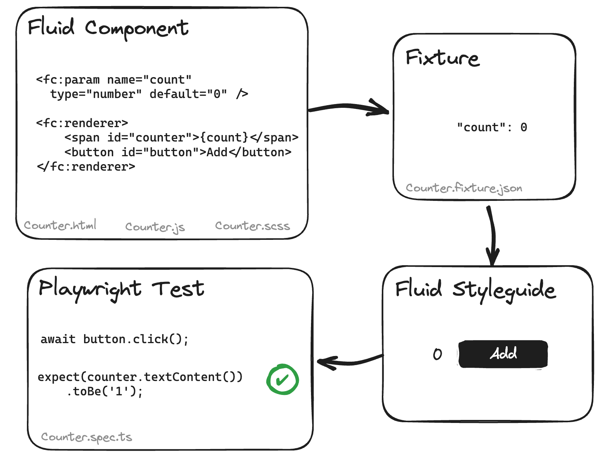

My setup for testing TYPO3 frontend code programmatically leverages Playwright to run end-to-end tests on individual Fluid Components. Utilizing Fluid Styleguide's fixture files, I can populate each component with mock data, enabling isolated testing of each component.

As an extra step, Axe-core is used as a plugin in Playwright for automated accessibility testing.

Playwright runs its tests using headless Chromium, Webkit, and Firefox browsers. For me this turned out especially usefull after updating NPM dependencies: `npx taze major -w && ddev npm i && npx playwright test`.

## References

- https://github.com/sitegeist/fluid-components
- https://github.com/sitegeist/fluid-styleguide
- https://github.com/microsoft/playwright
- https://playwright.dev/docs/accessibility-testing
- https://github.com/antfu/taze
