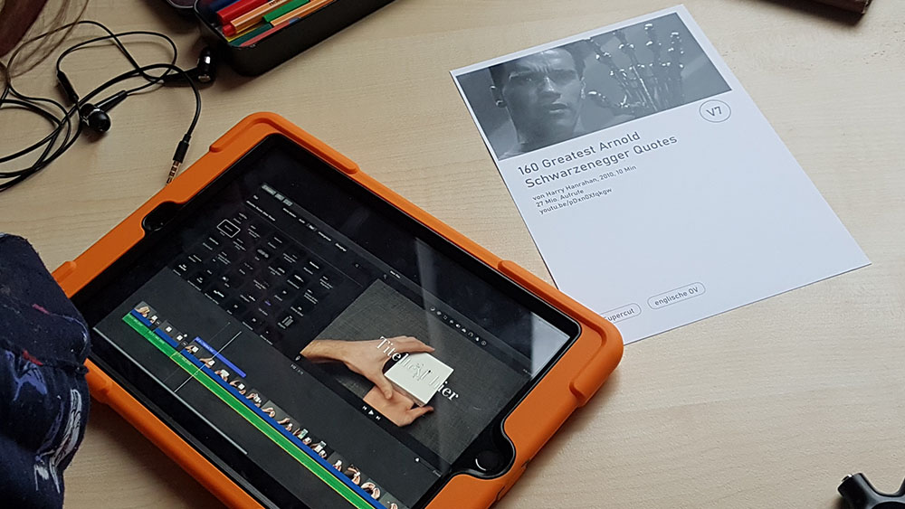

- 12./13.Dezember 2019, Lehrerfortbildung zu Videoessays, im Rahmen von [Filmlehrer digital](https://alp.dillingen.de/lehrerfortbildung/qualifizierungslehrgaenge/film-theater-medien-und-kunst/), ALP Dillingen
- 27.November 2019 Lehrerfortbildung [Videoessays – Filmkritik auf Youtube](http://service.pi-muenchen.de/onlineprogramm/kurs_blatt.php?a_programm_nr=75-DC0.09&a_ku_verw_von_ku_liste=&a_ku_jahr=2019), Pädagogisches Institut München

## Videoessays im Unterricht

Videoessays sind kurze Filme über Filme. Auf Youtube mit Abruf-Zahlen in Millionenhöhe, bietet sich das Format als praktisches Medienpädagigik-Thema im Mittel- und Oberstufenunterricht an. Das Erstellen von Videoessays mit dem iPad fördert die visuelle Lesekompetenz und gleichzeitig die Fähigkeit, sich im Medium Film und Video selbst zu artikulieren.

### Lerntheken

- [Lerntheken](/assets/videoessay_lerntheken_3.pdf) (1.8 MB)
- [Poster](/assets/videoessay_poster_3.pdf) (906.6 KB)
- [Adobe Indesign Vorlagen für Lerntheken & Poster](/assets/videoessay_lerntheken_3_indesign.zip) (17.6 MB)

## Teilnehmerstimmen

- „Ich habe die Anregung 'Videoessay/Filmbesprechung mit den unteren Klassen der Mittelschule' gleich nach Deinem sehr gelungenem Workshop erstellt. Dies wird mit Kollegen erprobt und evaluiert.“ (12./13.12.2019 ALP Dillingen)
- „Erst zugeballert von vielen Videoessays, dann durchgeblickt und zuletzt Lust bekommen selber welche zu produzieren. Danke Florian für deinen inputreichen inspirierenden Workshop #Filmlehrerdigital“ (12./13.12.2019 ALP Dillingen, via [Twitter](https://twitter.com/S__Erol/status/1205422963341889536))
- „Super Material zur Verfügung gestellt, gute und durchdachte Anregungen gegeben, schön praxisbezogen.“ (27.11.2019 PI München)
- „Angenehm den externen Blick eines Nicht-Lehrers zu erleben (nicht überdidaktisiert).“ (27.11.2019 PI München)
- „Alles prima, sehr guter Referent - perfekt in jeder Hinsicht!“ (27.11.2019 PI München)
